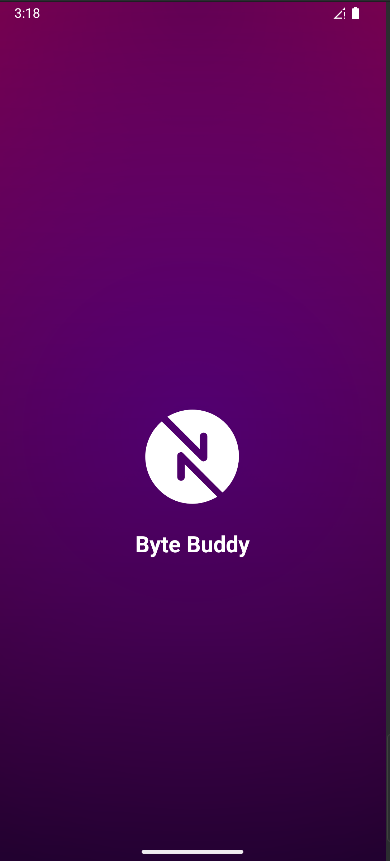
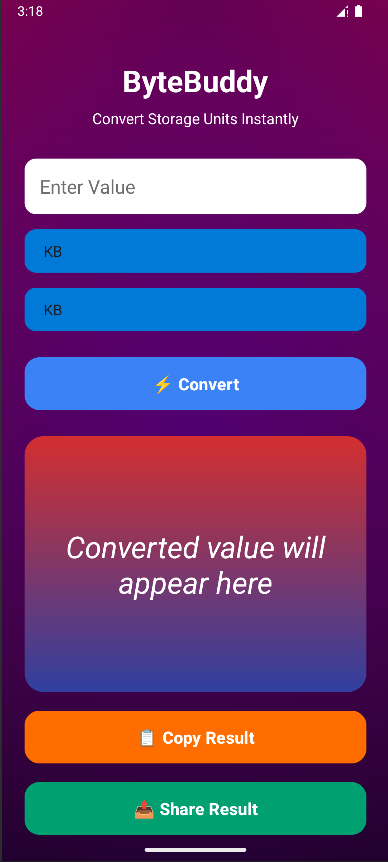
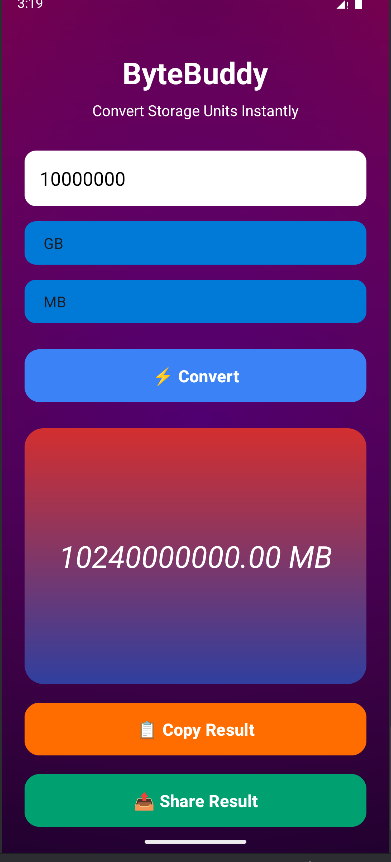

# ByteBuddy – Storage Unit Converter App

**ByteBuddy** is a simple Android app to convert storage units instantly. Whether it’s KB, MB, GB, TB, or PB, ByteBuddy makes it easy to calculate the correct value and share it with friends.

---

## Features

- **Unit Conversion:** Convert between KB, MB, GB, TB, PB with ease.  
- **Copy Result:** Copy the converted value to your clipboard.  
- **Share Result:** Share via social media or messaging apps.  
- **Clean & Full-Screen UI:** Large input, big buttons, and stylish result display.  
- **Accurate & Fast:** Conversion shows up instantly with 2 decimal precision.  

---

## Screenshots

| Main Screen | Conversion Result | Share Feature |
|-------------|-----------------|---------------|
|  |  |  |

---

## Installation

1. Clone the repository:
   ```bash
   git clone https://github.com/rohan-rusho/ByteBuddy.git
